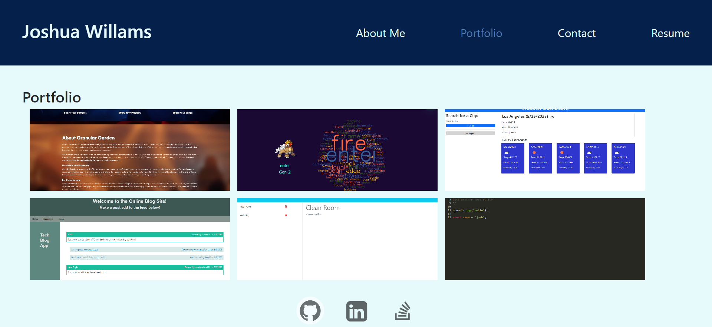

# react-portfolio

## Dexcription

The React Portfolio is a web application that showcases a developer's skills through various projects and a downloadable resume, built entirely with React. The portfolio allows the developer to show their projects not only to potential employers, but also to the entire development community to foster collaboration.

[React Portfolio](https://tourmaline-belekoy-0f066d.netlify.app/)
## Installation

N/A

## Usage

Navigate to the provided link to find the react app that shows the developer portfolio. The navigation links at the top of the page can be used to view the respective sections of the app. The Portfolio section includes links to the projects and their github repositories, and the Resume section includes a link to download the developer's resume.

## Credits

The Portfolio app design was heavily inspired by the mockup. The idea to leverage state management to switch between views was given by instructor.